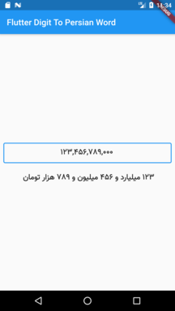

# digit_to_persian_word

The Flutter package for changing digit to the Persian word

demo:



## Add dependency
```
dependencies:
  digit_to_persian_word: ^1.0.3
```
## Usage
```dart
String _word = DigitToWord.change(digit: _controller.value.text);
String _word = DigitToWord.change(digit: _controller.value.text,regExp:",");
```
## example
[example](https://github.com/resfandiari/digit_to_persian_word/tree/master/example)

An example showing how to use
